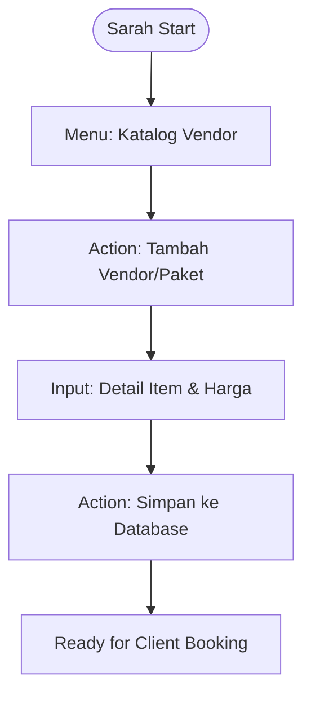
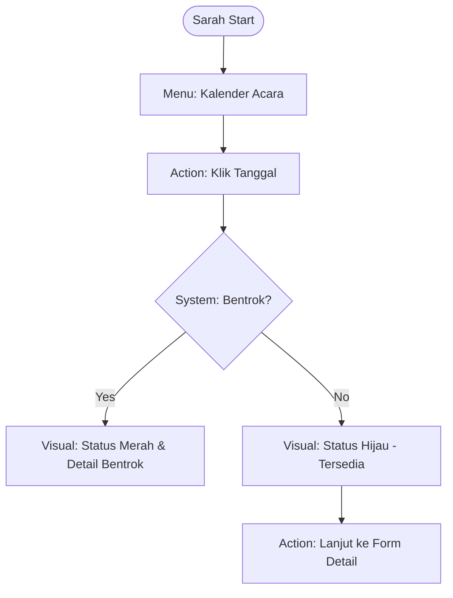
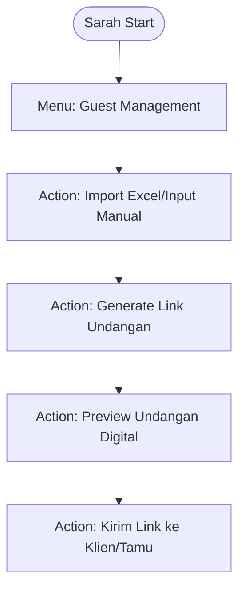

# UX Design Specification - Dream Syariah Wedding

---

## 1. Executive Summary (Initialization & Discovery)

### Project Vision

Visi proyek **Dream Syariah Wedding Organizer (Dream-Syariah-Wedding)** adalah mentransformasi operasional Wedding Organizer yang berlandaskan nilai-nilai syariah melalui otomatisasi dokumen yang presisi dan manajemen siklus acara yang komprehensif. Masalah utama yang diselesaikan adalah kompleksitas administrasi manual yang rawan kesalahan, khususnya dalam penjadwalan (*booking conflict*) dan koordinasi item vendor. Sistem ini berfungsi sebagai *Single Source of Truth* yang mengalokasikan tenaga admin dari "penata layout" menjadi "validator data" yang berwibawa.

### Target Users

1.  **Sarah (Admin WO - Sang Dirigen)**: Mengelola seluruh siklus dari konsultasi hingga pelunasan. Membutuhkan efisiensi tinggi dalam input data, validasi ketersediaan jadwal seketika, dan manajemen katalog vendor.
2.  **Budi (Tim Lapangan - Sang Eksekutor)**: Penerima output spesifikasi teknis yang sangat terstruktur untuk eksekusi yang *zero-error* di gudang dan lokasi acara.
3.  **Maya (Klien - Sang Pengantin)**: Menerima invoice profesional dan undangan digital yang mencerminkan kualitas layanan premium dan syariah dari WO.

### Key Design Challenges

- **Branding Syariah Premium**: Menyeimbangkan estetika religius yang tenang dengan fungsionalitas aplikasi modern yang cepat.
- **Manajemen Konflik Penjadwalan**: Bagaimana UI memvisualisasikan ketersediaan jadwal secara instan tanpa membebani kognitif admin.
- **Otomatisasi Lintas Dokumen**: Menjamin data yang sama mengalir dengan benar ke Invoice (Klien), Spesifikasi Teknis (Tim), dan Undangan Digital (Tamu).

## 2. Core User Experience (Step 3)

### Defining Experience

Pengalaman inti Dream-Syariah-Wedding berpusat pada **"Syariah Integrity & Instant Harmony"**. Admin Sarah tidak hanya mengisi formulir, tetapi ia sedang menyusun ekosistem acara yang teratur dan halal. Interaksi kritikal adalah **Real-time Conflict Validation**—momen ketika sistem langsung memberikan umpan balik tentang ketersediaan vendor dan jadwal saat Sarah sedang melakukan konsultasi.

### Platform Strategy

- **Optimized for Laptop & Tablet**: Form input didesain dengan *hit area* yang besar (min 44px) untuk kenyamanan tablet saat konsultasi tatap muka, namun tetap padat informasi untuk efisiensi laptop.
- **MPA Architecture with Split-View**: Memanfaatkan pendekatan Multi Page Application untuk stabilitas, dengan fitur *Split-View Preview* pada desktop untuk melihat draf dokumen berdampingan dengan form input.

### Effortless Interactions

- **Smart Catalog Selection**: Memilih paket katering atau dekorasi dari katalog vendor akan secara otomatis mengisi spesifikasi teknis lapangan dan draf invoice.
- **One-Click Handover**: Proses regenerasi dokumen (Invoice & Specs) dan link undangan digital dilakukan dengan satu aksi sentral setelah data divalidasi.

### Success Criteria

- **Zero-Conflict Confidence**: Sarah merasa 100% yakin bahwa jadwal atau vendor yang dipilih tidak bentrok.
- **Professional Presence**: Klien merasa terkesan dengan kecepatan Sarah memberikan invoice dan undangan digital yang terlihat "mahal".

## 3. Desired Emotional Response (Step 4)

### Primary Emotional Goals

Tujuan emosional utama adalah memberikan rasa **Ketenangan (Serenity)** dan **Kepastian (Certainty)**. Mengingat bisnis pernikahan syariah mengutamakan amanah, sistem harus mencerminkan kepercayaan melalui akurasi data dan tampilan yang tenang.

### Emotional Journey Mapping

- **Discovery/Login**: Rasa khidmat dan profesional—Desain yang tenang menyambut admin ke dalam sistem yang teratur.
- **Booking/Scheduling**: Rasa "Aman" (Safe)—Validasi sistem mencegah kesalahan fatal *overbooking*.
- **Documentation Moment**: Rasa "Berdaya" (Empowered)—Otomatisasi dokumen memberikan kebanggaan atas kualitas pekerjaan yang cepat dan rapi.
- **Client Handover**: Rasa "Bangga" (Proud)—Menyerahkan output premium yang berlogo "Dream Syariah".

### Emotional Design Principles

1. **Amanah in Accuracy**: Tidak ada ruang untuk ambiguitas; draf yang dilihat Sarah adalah draf yang diterima klien.
2. **Elegant Serenity**: Palet warna Navy dan Gold membangun suasana kerja yang fokus dan tenang.
3. **Implicit Trust**: Sistem bertindak sebagai pengingat dan penjaga (guardrail) bagi admin agar alur kerja tetap pada jalur yang benar.

## 4. UX Pattern Analysis & Inspiration (Step 5)

### Inspiring Products Analysis: Notion & Luxury Concierge

Dream-Syariah-Wedding menggabungkan efisiensi **Notion** dengan eksklusivitas **Luxury Concierge Services**.

- **Notion (Organization)**: Menggunakan sistem blok untuk mengelompokkan detail acara (Catering, Dekor, Dokumentasi) agar Sarah dapat mengelola data kompleks tanpa merasa kewalahan.
- **Luxury Concierge (Professionalism)**: Pola interaksi yang proaktif. Sistem tidak hanya menunggu input, tetapi menyarankan langkah selanjutnya (misal: "Jadwal tersedia, buat undangan digital?").

### Transferable UX Patterns

1. **Categorical Block Management**: Informasi dibagi menjadi kartu-kartu logis yang dapat "diciutkan" (collapsed) untuk menghemat ruang pada tablet.
2. **Contextual Property Automation**: Pemilihan paket vendor otomatis memicu pengisian draf harga di invoice dan item checklist di spesifikasi teknis.
3. **Anti-Conflict Indicators**: Pola visual "Traffic Light" (Hijau/Merah) pada kalender untuk menunjukkan ketersediaan slot acara secara instan.

## 5. Design System Foundation (Step 6)

### Design System Choice: Tailwind CSS with Premium Tokens

### Rationale for Selection

- **Navy & Gold Consistency**: Memungkinkan definisi token warna kustom yang mencerminkan logo Syariah secara presisi di seluruh elemen UI.
- **Responsive Fluidity**: Menjamin transisi mulus antara tampilan admin (Dashboard/Form) dan tampilan eksekusi (Field Checklist) di berbagai perangkat.

### Visual Design Tokens

- **Colors**:
  - `Primary-Navy`: `#0B2545` (Trust, Authority)
  - `Accent-Gold`: `#B89336` (Premium, Quality)
  - `Base-White`: `#FDFDFD` (Purity, Clarity)
  - `Surface-Cream`: `#F8F4E8` (Warmth, Welcome)
- **Typography**:
  - Headings: **Lora** (Serif) — Memberikan kesan mewah dan tradisional Syariah.
  - Body: **Inter** (Sans-serif) — Menjamin keterbacaan data yang optimal.

## 6. Defining the Defining Experience (Step 7)

### Defining Experience: "The One-Click Syariah Handover"

Aksi inti yang mendefinisikan produk ini adalah momen ketika Sarah menekan tombol **"Selesaikan & Serahkan"**. Sistem secara instan:
1. Memvalidasi seluruh data (Input Integrity).
2. Melakukan *categorical mapping* ke template PDF premium.
3. Menghasilkan link unik untuk Undangan Digital.
4. Menampilkan status pembayaran awal (DP).

### Success Criteria

- **Speed**: Seluruh aset siap dalam < 3 detik.
- **Harmony**: Data di Invoice, Spesifikasi Lapangan, dan Undangan Digital sinkron 100%.
- **Delight**: Sarah merasakan kepuasan instan karena tugas administratif berat selesai dengan satu klik.

## 7. Visual Design Foundation (Step 8)

### Color System: "Syariah Grandeur"

- **Primary (Navy Blue)**: `#0B2545` — Digunakan untuk elemen pondasi, sidebar, dan judul utama untuk memberikan kesan otoritas.
- **Accent (Premium Gold)**: `#B89336` — Digunakan untuk elemen interaktif (tombol, ikon aktif, border kartu) untuk kesan eksklusif.
- **Functional Background**: `#FDFDFD` dengan pemisahan tipis menggunakan `#E2E8F0`.

### Typography System

- **Headings**: **Lora** (Serif) — Membangun identitas "Syariah" yang elegan.
- **Data & Body**: **Inter** (Sans-serif) — Menjamin efisiensi Sarah saat memindai data ribuan tamu atau item vendor.

## 8. Design Direction Decision (Step 9)

### Chosen Direction: "Premium Navy & Gold Card-Based Workflow"

Arah desain ini terpilih karena memberikan keseimbangan terbaik antara **kepadatan informasi** (untuk admin) dan **estetika premium** (untuk klien).

- **Branding Alignment**: Mengambil elemen visual langsung dari logo `Dream-Syariah-WO.png`.
- **Component Logic**: Penggunaan kartu (Cards) dengan aksen *border-left* Gold mempermudah pengelompokan fitur baru (Vendor, Guest, Booking).

## 9. User Journey Flows (Step 10)

### 1. Manajemen Katalog Vendor & Paket (Sarah)

Sarah membangun "gudang data" sebelum melakukan transaksi klien.



### 2. Booking dengan Validasi Anti-Bentrok (Sarah)

Proses kritikal untuk menjaga amanah dan profesionalisme.



### 3. Pengelolaan Tamu & Undangan Digital (Sarah)

Transformasi dari data statis menjadi interaksi klien.



### 4. Pelacakan Pembayaran & Status Keuangan (Sarah)

Menjaga disiplin finansial WO.

```markdown
**Alur**: Dashboard -> Pilih Klien -> Update Status (DP/Lunas) -> System-Generated Updated Invoice -> Send to Client.
```

## 10. Component Strategy (Step 11)

### Syariah Custom Components

1.  **Conflict-Guard Calendar**:
    - **Visual**: Kalender bulanan dengan marker `Gold Dot` untuk jadwal tersedia dan `Navy Stripe` untuk slot penuh.
    - **Interaction**: Hover pada tanggal menampilkan tooltip cepat nama klien yang sudah booking.
2.  **Vendor Item Card**:
    - **Visual**: Kartu putih bersih dengan label harga Gold di pojok kanan atas.
    - **Interaction**: Tombol "+" untuk memasukkan item langsung ke draf klien.
3.  **Guest Data Grid**:
    - **Visual**: Tabel padat informasi dengan status "Undangan Terkirim" (Badge Gold).
    - **Action**: Tombol "Generate & Copy Link" di setiap baris.
4.  **Payment Status Badge**:
    - **Lunas**: Solid Gold background with Navy text.
    - **DP/Unpaid**: Navy border with Navy text.

## 11. UX Consistency Patterns (Step 12)

### Button & Navigation Hierarchy

- **Primary Action (Generate/Save)**: `bg-navy-blue text-gold font-bold` — Mencolok dan memberikan kesan finalitas.
- **Secondary Action (Edit/Preview)**: `border border-gold text-navy-blue`.
- **Global Navigation**: Sidebar tetap dengan ikon Gold yang merefleksikan brand Dream Syariah.

### Feedback Systems

- **Validation**: Border emas menyala saat input sukses; border merah tipis saat gagal.
- **Loading State**: Animasi logo mandala berputar perlahan selama proses PDF generation.

## 12. Responsive Design & Accessibility (Step 13)

### Role-Based Responsive Strategy

1.  **Sarah (Consultation - Tablet/Desktop)**: Optimasi Split-View. Form di kiri, pratinjau dokumen di kanan. Touch targets minimal 48px.
2.  **Budi (Field - Mobile/Print)**: Tampilan Checklist Spesifikasi Teknis yang kontras tinggi, font besar (16px+), dan checkbox yang mudah ditekan dengan satu tangan.
3.  **Maya (Client - Mobile)**: Tampilan Invoice PDF yang mobile-friendly (single column layout).

### Accessibility Focus

- **Contrast**: Rasio kontras Navy (#0B2545) terhadap Putih adalah 12:1 (Melebihi WCAG AAA).
- **Keyboard Friendly**: Navigasi form menggunakan `Tab` dengan indikator fokus emas yang jelas.

## 13. Finalization & Review (Step 14)

### Conclusion

Pembaruan UX Dream Syariah Wedding Organizer ini menjamin transisi yang elegan ke identitas brand baru sembari mengakomodasi fitur-fitur operasional yang lebih kompleks. Dengan fokus pada **Ketenangan Visual** dan **Kepastian Data**, sistem ini siap mendukung operasional Wedding Organizer yang amanah, efisien, dan premium.

---
